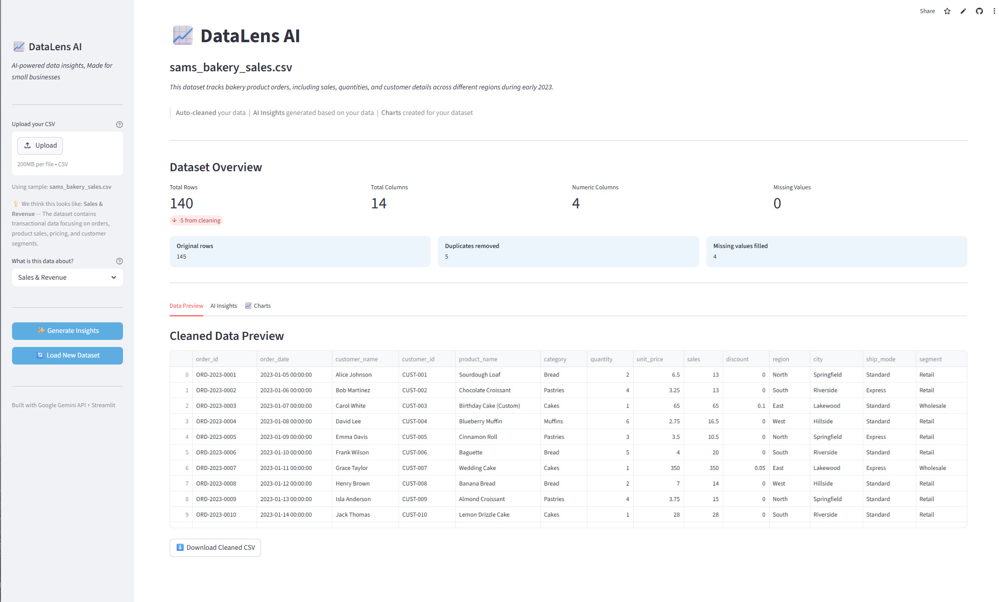
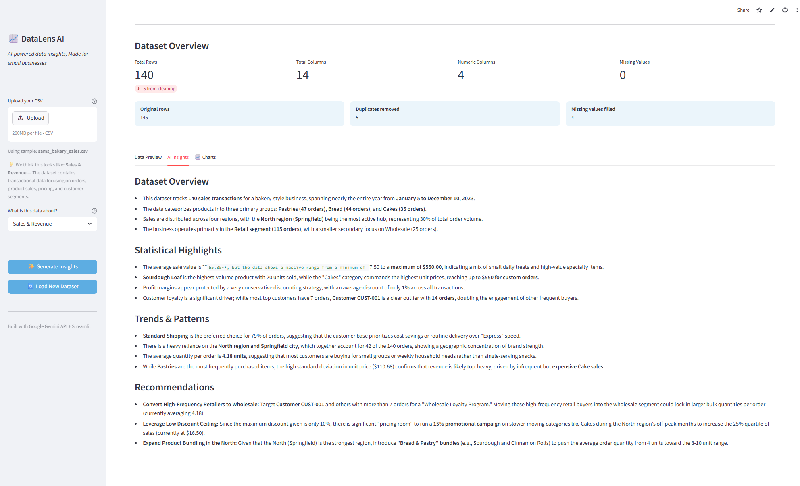
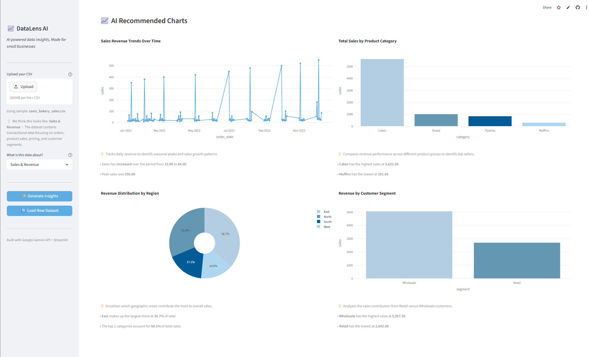

### 📈 DataLens AI

DataLens AI is a lightweight data insights tool built for small businesses. Upload sales, marketing, or finance data and get AI-powered insights.

[Live Demo](https://data-lens-ai.streamlit.app/) 

---

#### Features

- **Automated data cleaning pipeline** — detects and fixes missing values, removes duplicates, and  classifies column types using AI (- **Export ready** — download the cleaned dataset as a CSV )

- **AI-generated insights** — produces simple trends, patterns, and recommendations tailored to the dataset type using Google Gemini API

- **Smart chart recommendations** — AI analyzes the dataset and selects the most relevant visualizations, complete with simple takeaways for each chart

---

#### Tech Stack

- **Streamlit** — dashboard
- **Google Gemini API** — AI insights and chart recommendations
- **Pandas & NumPy** — data cleaning
- **Plotly** — interactive charts

---

#### Try It With Sample Data

Not sure where to start? The app comes with three sample datasets — just click to load, no upload needed.

